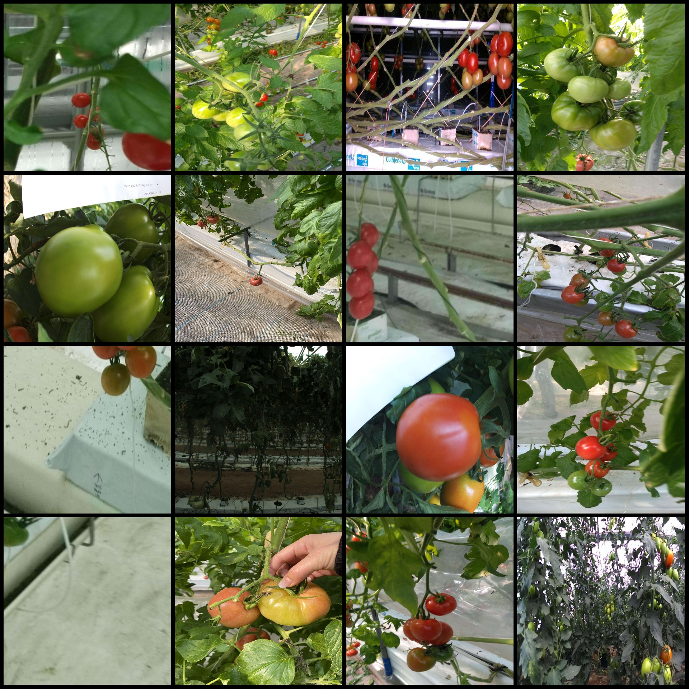
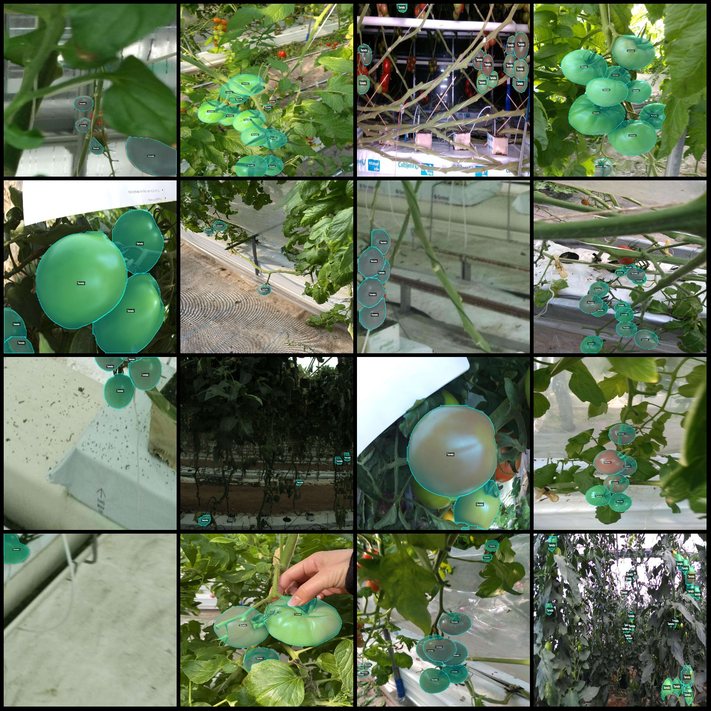
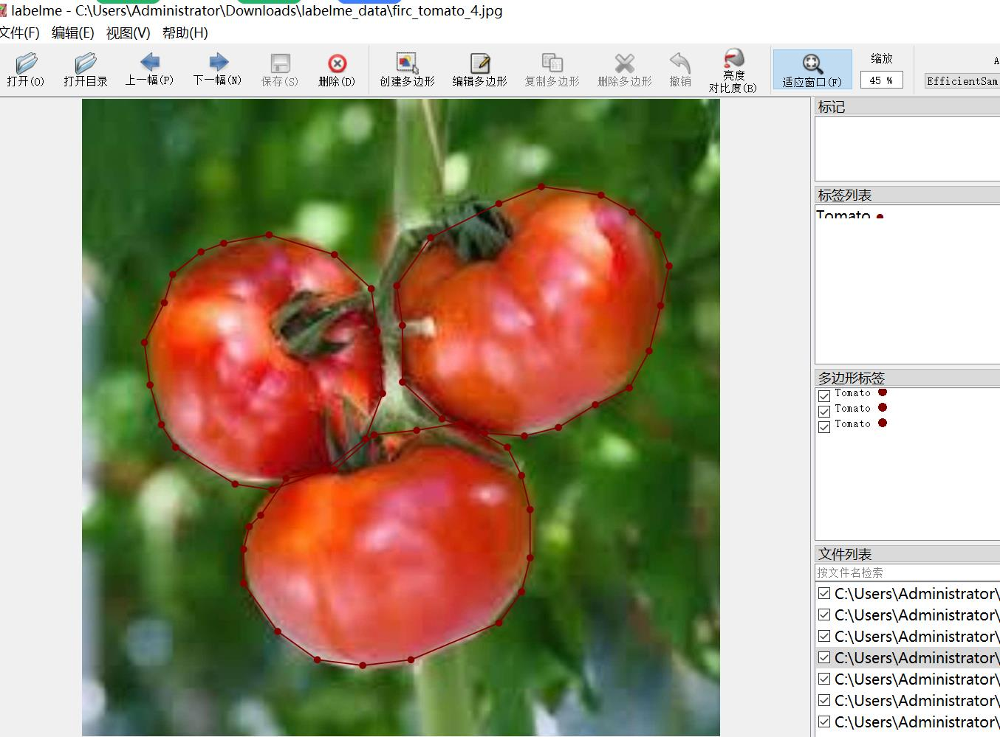

# Smart Agriculture Tomato and Tomato Segmentation Dataset - LabelMe Format with 2218 Images

**Dataset Format:** LabelMe format (excluding mask files, only containing jpg images and corresponding json files)

**Image Counts:** 2118 JPG files

**Annotation Counts:** 2118

**Number of Annotation Categories:** 1

**Annotation Category Name:** "Tomato"

**Number of Bounding Boxes per Category:**
- "Tomato" count = 22136
- Total bounding boxes: 22136

**Annotation Tool:** labelme = 5.5.0

**Image Resolutions:** Multi-resolution images, such as 1920x2560, 1920x2400, etc.

**Annotation Rules:** Polygons are drawn around the categories.

**Important Notices:** The dataset can be opened and edited using labelme. The json data set needs to be converted into either a mask or Yolo format for semantic segmentation or instance segmentation.

**Special Statements:** This dataset does not guarantee the accuracy of the trained models or weight files.

**Image Preview:**

**Examples of Annotations:**

**Annotation Drawing Results:**

**LabelMe Editing Example:**

## Images

Here is a pay link on Stripe ( https://buy.stripe.com/3cs8yP7sY87d0vu9AB ). Please contact me lonlonago@foxmail.com after funding $89, and I will send you a complete data files , thank you!

